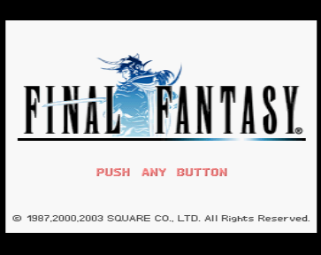
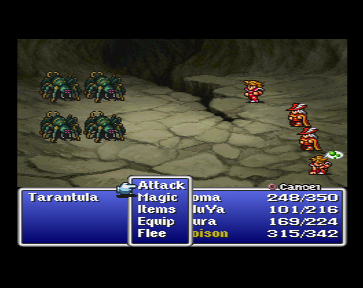
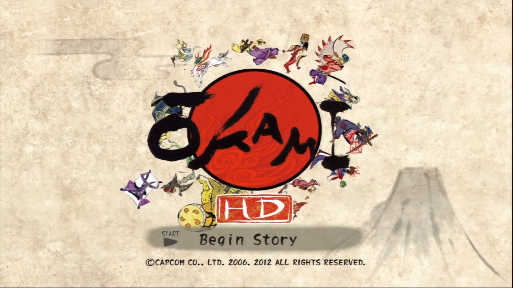
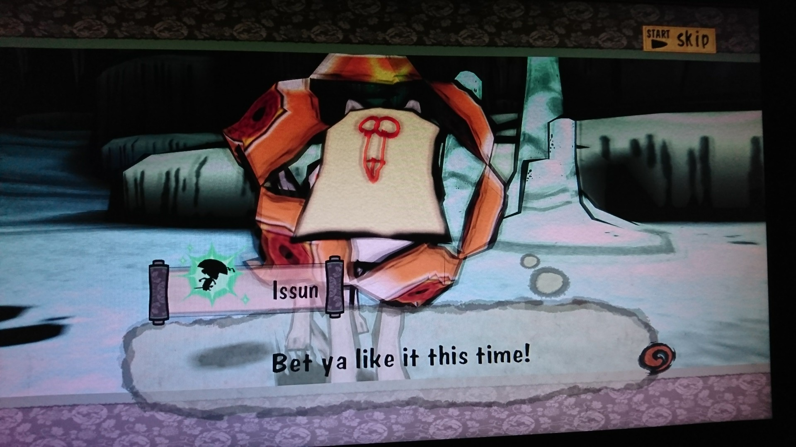
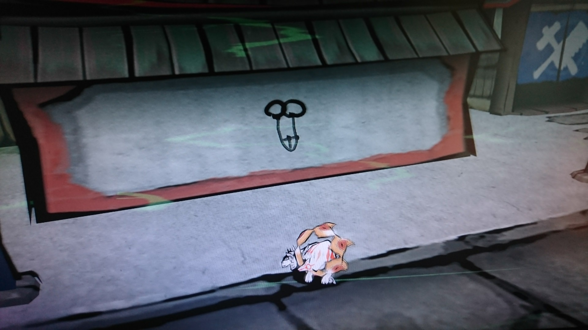

So this kind of post will be probably be a recurring one as it gives me a chance to talk about some games that I might otherwise not talk about. For short I'll call it GIBP

# Final Fantasy

To start of I've been playing some of the original Final Fantasy, the version included in Final Fantasy Origins on PS1. The main reason I decided to play it is that I've been meaning to play through the Final Fantasy series as I have never completed a Final Fantasy game despite having played many of them. I think this has to do with JRPGs where I personally find them hard to get into because they tend to leave you to figure out where you are going and what you need to progress. Now that doesn't sound like a bad thing in an age where most games hold your hands and never let go but the problem is that when you have no idea where you're going in a large and open world like in Final Fantasy it becomes very tedious when you are constantly encountering enemies every few steps. This is especially bad in Final Fantasy as there have been many times where I have finished a battle, walked one step and it triggered another battle. So I decided to play through the game using a guide, now some of you may think that using a guide ruins the experience but for me when I played this game a few years ago on the PSP the experience was ruined by me getting completely lost and frustrated with the constant battles. As a result I have enjoyed Final Fantasy a lot more than I did previously and I've got much further through the game (Around half way I think).

While I have been enjoying there are a couple of things that have been really bugging me which have definitely made this game much more infuriating than it should be. First of all, poison is absolutely terrible. Like most games when one of your party members are poisoned they will lose a little bit of health each turn in battle and each step in the overworld until they reach 1 HP. This on its own wouldn't be so bad, the problem is, the only way to cure poison until much later in the game is through the use of antidotes or death. So not only is it a pain to cure but so many enemies have poison so you need a lot of antidotes as in any battle all 4 of your party members could be poisoned. In the end I just bought 99 antidotes which cost 5940 Gil as each one is 60. 
The next problem I have is that the encounters are far too common. Every few steps you take will trigger an encounter and what makes this much worse than other games with random encounters is that the encounters take a long time as they usually have a lot of enemies (up to 9) so every turn you have to wait for all of the enemies to attack. Fleeing is very unreliable and you should probably fight everything for exp to reduce grinding so getting around the map is tedious.
You'd think after all that complaining I hate the game but actually I've been enjoying it despite the problems. It's available in english on PS1, GBA, PSP and Android

# Sonic & All-Stars Racing Transformed

This was the game I've played the most out of the mentioned games. With almost all of the career mode finished I have a total of 41 hours of playtime on steam. 
Sonic & All-stars Racing Transformed is the best kart racer I have played on PC, a platform that is severely lacking in games within the genre, rivalling games such as Mario Kart and Crash Team Racing. At a glance it looks like Mario Kart but with Sega characters and that's exactly what it is, which is very much a good thing. It makes me wish that we'd get more games like this, a PlayStation kart racer would be amazing. 
Now as it is almost identical to Mario Kart it has the main downfall of the games which is that the races can be luck based a lot of the time as you can drive perfectly but get hit in succession by the items setting you so far back that you cannot recover. This is amplified by the expert difficulty AI which have pinpoint accuracy where the deciding factor for you winning is whether you get your all-star which is an item that makes you much faster and immune to damage.
Overall it's an excellent game which is currently on sale for £3.75 on Steam and is well worth the money. It's also on PS3, 360, Wii U, PS Vita, 3DS, and mobile (Not sure the handheld versions are as good)

# Okami

Now here is my favourite game I've played recently, Okami was a huge surprise to me once I finally got into the meat of the game. When I got the game almost half a year ago via the HD version on PS3 I played the beginning section of the game and while I didn't dislike what I played I also wasn't super into it. However I definitely admired the gorgeous art style of the game which looks exactly like ancient Japanese illustrations which is very fitting for the theme of the game. You are wolf God named Amaterasu, which by the way I love that you play as a wolf that can run super fast as it makes a change from playing a humanoid character. Another thing that I just love is some of the smaller things like how Amaterasu will go to sleep after a while as he does not give a flying fuck about what people have to say which I just adore. 
What got me into the game was coming back to the game where I left off which happened to be the exact moment where the game opens up. The game feels very similar to The Legend of Zelda with a bit more linearity and a completely different combat system and that combat system is really good which shouldn’t be surprising as it was developed by Clover Studio who are now known as Platinum Games. But the highlight of the game for me, at least so far (20 hours in), was when I got to draw a picture on a mask to use as a disguise. So of course I drew a penis, as you do.

But that's not the highlight, the highlight was that the same picture I drew appeared later on in the game in a town on some of the walls, seeing this I laughed out loud.

Excuse the not so good quality of the pictures, I used my phone as I don't have a way to capture the PS3. So anyway I highly recommend Okami which is available on PS2, Wii and PS3. I would love to see a PC port of it but I highly doubt that will happen.

Outside of that I've been playing a small bit of a bunch of other games but these were the ones I have a lot to say about. So this has been my first GIBP.

I should probably get a comment section setup for these shouldn't I?
Well if you have something to say about this or just want to tell me that someone actually is reading this email me at me@toby.world