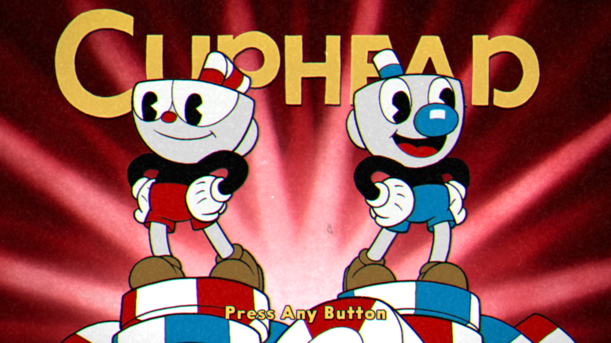
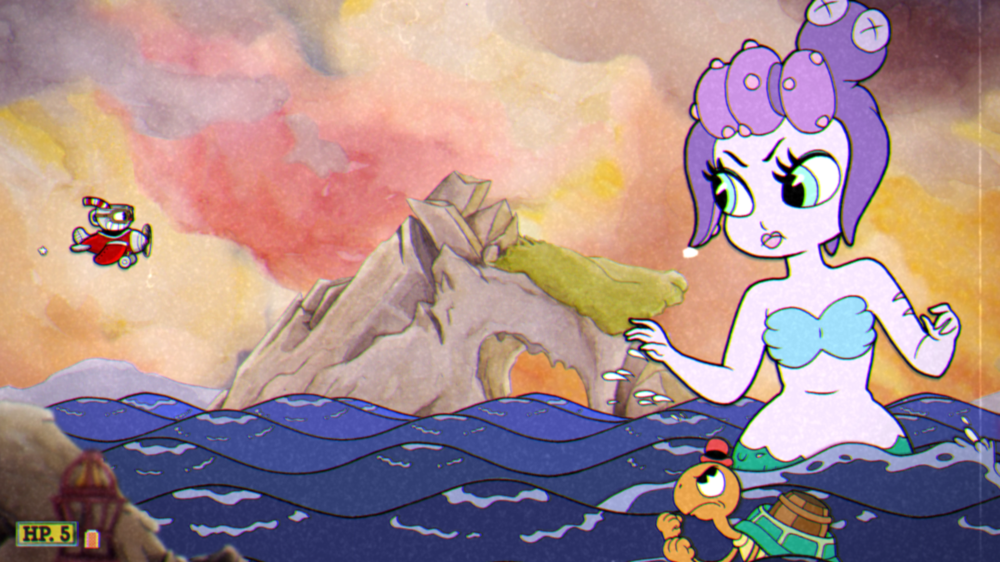
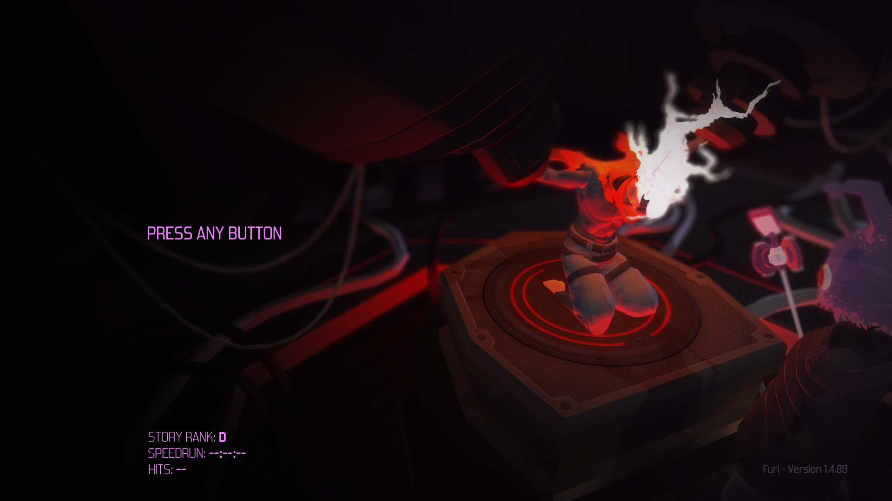
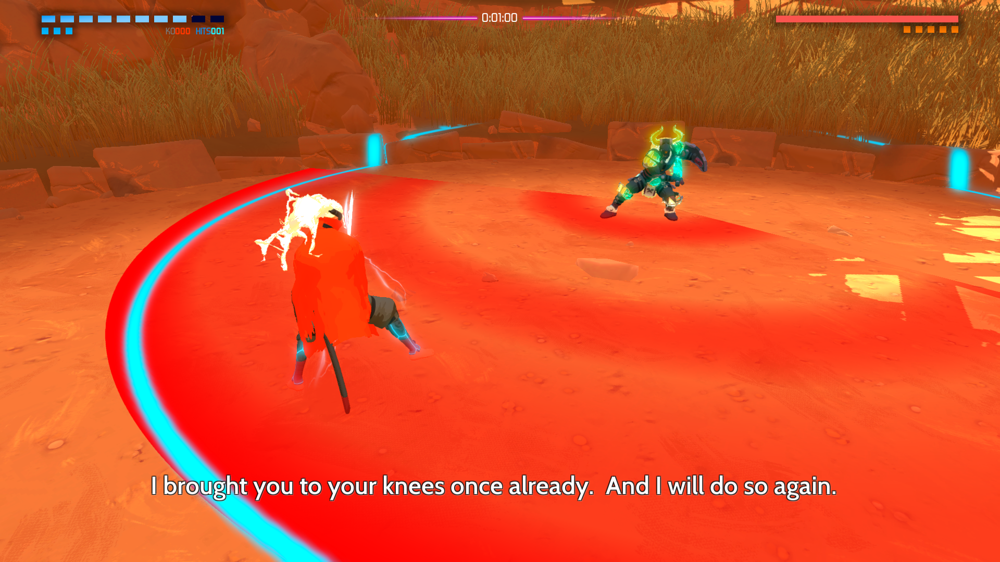
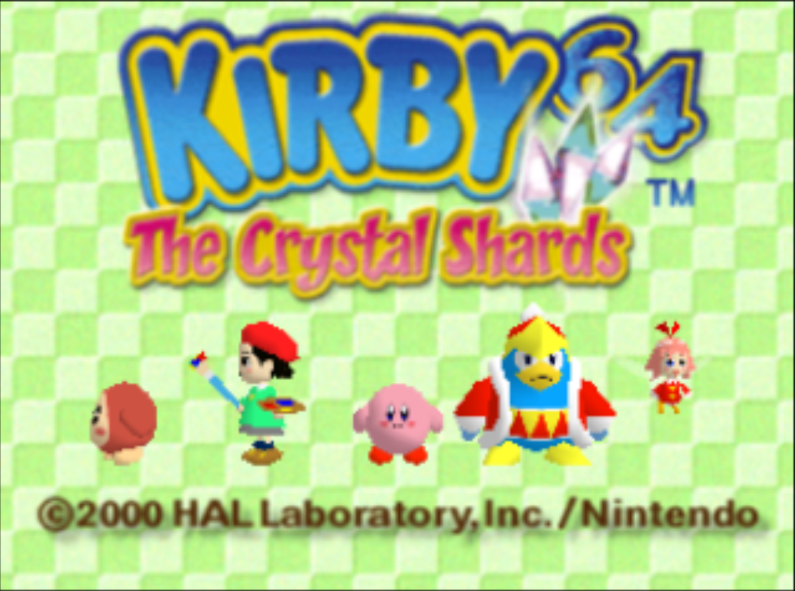
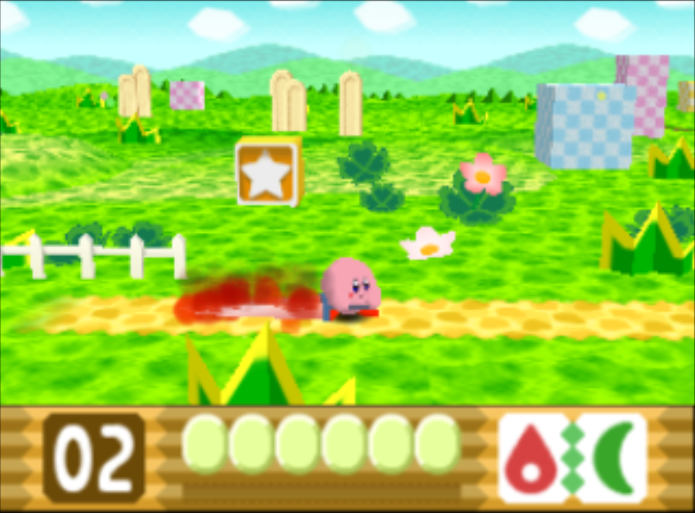
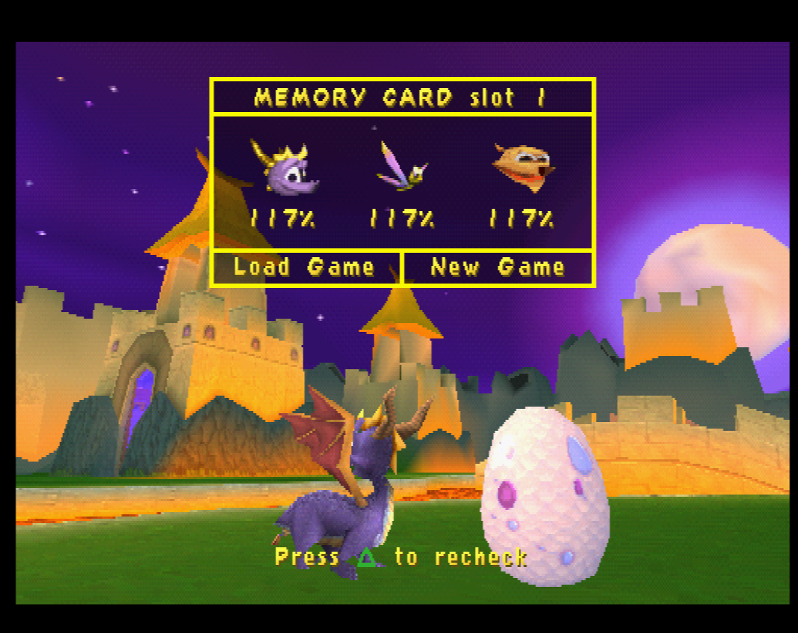

So it's been about 4 months since I last made a post, not that any has seen any of the posts anyway. Anyway I thought I'd be able to do these easily, quickly and regularly well that didn't happen although since then I've started university and am no longer living at home. Anyway I've played a lot of games since I've forgotten a lot of them and I had one of these half written months ago which I don't have since I left my desktop at home which is where it is. So I'll be covering the  games I recently played and oh boy I've played some really great games this time.

# Cuphead

Yes I've been playing Cuphead like a lot of people have been recently. Since it's been talked about so much and so recently I won't go into too much detail but I will say, yes it looks amazing and yes it plays really well. However, there's one gripe I have with the game and that is that I don't feel like I'm fighting a boss, I'm surviving a boss. This is because almost every boss does not show any damage until you defeat it, when the boss transitions into a new phase it doesn't look like there's any reason for them to change to that phase when they show no sign of damage. Not only that but it doesn't feel like the phases switch because you damaged the boss enough but instead you survived for a certain amount of time. This could be helped if the progress bar shown when you die was just shown on the HUD as it is basically a health bar. Now showing the bar may seem like a minor change that wouldn't be helpful but actually it would be a good way to see the difference in damage of the different weapons and supers because if you see the bar going along much quicker than it did when using another weapon you can imediately feel the difference. Now the difference in damage with the supers is very obvious as they clearly make a phase last a lot less time however the difference in the weapons isn't really felt.

Despite those gripes I think it's a fantastic game however, not close to my favourites list unlike a certain game following this one. It's available on PC and Xbox One.
Also I found a glitch which I can't seem to reproduce now however, could repeatedly before (and no, the game hasn't updated). I found the glitch after using my newly bought PS4 controller with DS4 Windows which the game treats as having 2 controllers at the same time. And after that during a boss fight I tried to remove player 2 which instantly made player 2 join again without removing player 2 in the first place resulting in 3 players all controlled with the same controller in the game at the same time. Also that reminds me that the game has native DS4 controller support which is great however there's one small annoyance with how they did the button prompts, instead of using the symbols they used the full names of the buttons so you have prompts that look like "CIRCLE", "CROSS", etc. And that wouldn't be a problem if some of the prompts weren't so close to each other as it results in them overlapping.

# Furi

Furi was a game I was mildly interested in when it released and thus added it to my unending steam wishlist which will unlikely ever be emptied. So I hadn't really thought about the game much until I got it in the Humble monthly bundle which turned out to justify the entire cost of the bundle as it has become one of my favourite games I've played this year. Holy shit this game feels so, so, so good to play. I haven't felt so excited and pumped while playing a game in years. First of all this game has a fucking badass soundtrack which really adds to the entire feel of the game. I should mention, this game is boss rush game similar to how Cuphead also is one although this game is a completely different game in every other aspect. The boss fights in this game are all very unique and all very challenging with the exception of the first and second to last boss or the last depending on a choice at the end. While the moveset you have may seem quite basic it actually has a lot of hidden depth. The advantage of this limited and unchanging moveset is that you can master the moveset and focus completely on learning the bosses instead of some new ability you've gained or even lost. Some bosses do however prevent your moves from working on them which I will go into a bit more detail on in just a moment. So what is the moveset of your character? Well you have a katana which you can do a combo with 4 slashes in a row. You have a auto laser pistol to attack from afar, you have a dash to avoid attacks, move through attacks or go over gaps in the arena. All of these can be charged up to increase the effectiveness of each for example a charged dash will make you go further and the other 2 will do more damage. The game also has a parry mechanic which can be used to counter melee attacks from the boss as well as projectiles which are deflected by the parry. Getting these parries perfect feels so damn good and is actually quite easy as it is indicated by a sound effect and a flash. Getting a parry timed right not only blocks the attack but also rewards you with health and if you get the timing perfect you can do a counter attack that has a unique animation sequence for each boss. 

And now I will explain how the bosses and health system works. So each boss has a health bar with squares underneath it which indicates how many phases the boss has which sometimes is quite a lot. The way bosses usually work is that each phase they have 2 health bars, during the first health bar the fight gives the player the freedom to move all around the arena and use mainly ranged attacks and dodge a lot of projectiles while during the second health bar the player goes into a close combat fight where they move much slower and cannot shoot. This usually involves using the dash to quick avoid attacks and the parry to then deal a lot of damage with the katana. There are a few bosses where a phase may only be close combat or only ranged but in most cases it will be both. So something I haven't mentioned is that this game is very hard but very forgiving and one of the reasons for this is the way it handles death. Instead of a death resulting in the player starting the boss from the beginning you are revived and are given 3 retries which 1 of which is restored after completing a phase, this is great because the first time you get to a phase in a boss you are probably going to fail as you don't know what's going to happen and you haven't learnt the patterns so this system means that you can never game over the first time you try a phase. So lastly I will mention my least favourite part of the game, the parts inbetween the bosses, these sections you just have to walk through a linear path very slowly while a character called "The Voice" is narrating giving some story to the game. While these sections look very nice and the story stuff is appreciated and the music is amazing, these are clearly made for the story and to be a breather so it's not a gauntlet of bosses. They even have an autowalk so you don't even have to do anything and in fact it's better to use the autowalk as it means you won't waste time accidently going the wrong way or fighting with the weird controls going between different camera angles. The first time playing the game I had no problem with these sections at all. The problem is that replaying the game on Furier difficulty, which is unlocked after completing the game, there is no way to skip them which is quite annoying when the cutscenes are skippable.
So overall this game is absolutely amazing and if you don't buy the game or whatever I highly recommend you go listen to the soundtrack because it is quite amazing. It's available on PC, PS4 and Xbox One.
Also the character designs are done by Takashi Okazaki, the manga artist for Afro Samurai which is cool so yeah.

# Kirby 64: The Crystal Shards

Kirby 64 is the first Kirby game I've finished and I finished it in only 2 sessions so that should say something about this game, it's pretty good. This game has a mechanic that is so good and a clear evolution on the mechanics of the previous Kirby games however, future Kirby games have just don't include it at all and that mechanic is combining copy abilities. So copy abilities are a pretty cool idea on their own, you eat an enemy and gain their powers, pretty cool on its own. Kirby 64's combining copy abilities allows you to take any copy ability and throw it at another enemy with a copy ability to combine it into a new ability. So not only do you want to find out what powers you can get from enemies you also want to figure out what each combinations give you. For example you take the cutter ability and the flame ability and you get a giant flaming sword that Kirby carries behind him and anything that touches the sword will be damaged regardless of whether you swing the sword or not. Another example is you take the ice ability and the spark ability and you become a fridge that throws food out of it that can damage enemies and heal Kirby. There's just so many combinations it really adds a huge layer of depth to Kirby which is awesome. 

I should mention that Kirby is really adorable in this game, like he is in most of them but the cutscenes really are just great with Kirby being the most adorable thing ever in all of them. The soundtrack as well is great which has plenty of remixes of the classic Kirby tracks like most Kirby games do. 

So out of all the Kirby games I've played this is my favourite so far. I've been in a Kirby mood after Hippocrit's recent videos for his Kirby month so I've been playing a bunch of the Kirby games mostly using my 3DS.
I played this game using the mupen64 core for Retroarch which is now my preferred way to play N64 games as first of all it's N64 emulation that actually looks pretty close to how it looked originally unlike Project 64 which renders at a higher resolution than the N64 did. Anyway although Retroarch seems really popular I'm not a huge fan of it and will only be using it for N64 emulation as I'm perfectly fine using emulators on their own.

I also replayed Spyro Year of the Dragon for the third time this year, which is my favourite game of all time and well here's what my saves look like now.

So that wraps up the second GIBP hopefully next time I'll get one done quicker, although that will depend on whether I play any noteworthy games.

I dunno if I can be bothered to setup a comment section here so if you actually did read this then make me aware of your existence by emailing me with me@toby.world